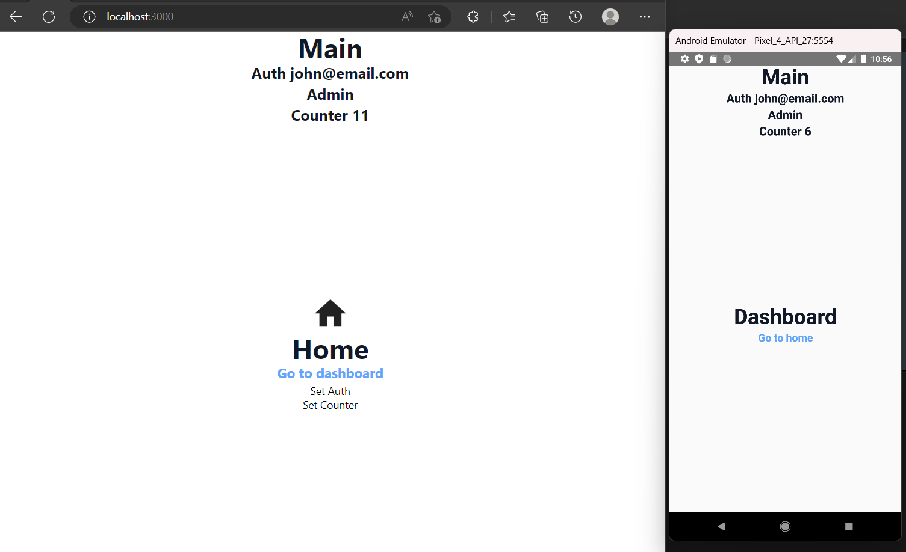

<div align="center">
  
</div>

<h1 align="center"> 
	🚀 react-native-web 🚀
</h2>

<div>
  

  
  
  <a href="https://github.com/jardelbordignon/rnw-base/commits/master">
    
  </a>

  
   <a href="https://github.com/jardelbordignon/rnw-base/stargazers">
    
  </a>
</div>

<br/>

## 💻 Sobre o projeto

O projeto é o produto de uma busca por meios práticos de se criar soluções.<br/>
Possui pouquíssimos recursos, apenas o suficiente para se explorar o react-native-web e outras techs pertinentes.

<br/>

## 🛠 Tecnologias utilizadas

- [Esbuild][esbuild]
- [React][reactjs]
- [React Native][rn]
- [React Native Web][rnw]
- [React Router Dom][rrd]
- [React Router Native][rrn]
- [Recoil][recoil]
- [Recoil Persistence][recoil-persistence]
- [TypeScript][typescript]

<br/>

## 🚀 Como executar o projeto

```bash
# Clone este repositório
$ git clone https://github.com/jardelbordignon/rnw-base

# Acesse a pasta do projeto no terminal/cmd
$ cd rnw-base

# Instale as dependências
$ yarn

# Execute o app mobile 
$ yarn start

# Execute o app web
$ yarn web
```

## 📝 Licença

Este projeto esta sobe a licença MIT.

Feito com ❤️ por Jardel Bordignon 👋🏽 [Entre em contato!](https://www.linkedin.com/in/tgmarinho/)

[typescript]: https://www.typescriptlang.org/
[reactjs]: https://reactjs.org
[esbuild]: https://esbuild.github.io/
[rn]: https://facebook.github.io/react-native/
[rnw]: https://necolas.github.io/react-native-web/
[recoil]: https://recoiljs.org/
[recoil-persistence]: https://github.com/davwheat/recoil-persistence/
[rrd]: https://www.npmjs.com/package/react-router-dom/
[rrn]: https://www.npmjs.com/package/react-router-native/
[yarn]: https://yarnpkg.com/
[vscode]: https://code.visualstudio.com/
[vceditconfig]: https://marketplace.visualstudio.com/items?itemName=EditorConfig.EditorConfig
[license]: https://opensource.org/licenses/MIT
[vceslint]: https://marketplace.visualstudio.com/items?itemName=dbaeumer.vscode-eslint
[prettier]: https://marketplace.visualstudio.com/items?itemName=esbenp.prettier-vscode